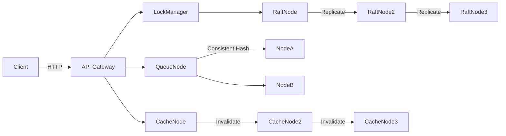

# System Architecture

## Overview
The distributed synchronization system is built around a fully connected network of independent nodes communicating via asynchronous HTTP (aiohttp) over a simulated geo-distributed network topology. It exposes several abstraction layers to the client including a Distributed Lock Manager (DLM), a Distributed Queue, and a Distributed Cache. All internode communications are secured via End-to-End Encryption (E2E) and Role-Based Access Control (RBAC).

## High-Level Architecture
1. **Network Layer (`NetworkManager`)**
   - Handles HTTP routing and `aiohttp` client sessions.
   - Provides an inter-node RPC endpoint (`/rpc`) which intercepts, decrypts, authenticates, and routes incoming messages to specific managers using message types.
   - Incorporates a **Geo-Distributed Simulator** applying artifical latency when nodes communicate across regions (e.g., `us-east` to `eu-west`).

2. **Security Layer (`SecurityManager` / `RBACManager`)**
   - All payloads are serialized to JSON, then encrypted using `cryptography.fernet` (AES-128 in GCM mode) using a pre-shared 256-bit symmetric key.
   - The RPC handler extracts plain metadata (source node, target action) and checks permission arrays before decrypting the core payload.

3. **Consensus Layer (`RaftNode`)**
   - Maintains the distributed State Machine using the **Raft Protocol**.
   - Handles elections (Candidate, Follower, Leader statuses), heartbeat generation, and log replication.
   - Essential for strict consistency requirements within the Distributed Lock Manager.

## Component Architectures

### A. Distributed Lock Manager (`LockManager`)
- Relies entirely on the `RaftNode`.
- Lock requests (`acquire`/`release` for `shared`/`exclusive` locks) are forwarded to the Raft Leader.
- The Leader appends the lock request into the log and waits for a quorum replication. Once committed, the instruction is applied to the replicated `locks` state machine.
- Includes a basic **Wait-for Graph** deadlock detection logic that preemptively denies a lock if an acyclic graph traversal detects a cycle.

### B. Distributed Queue (`QueueNode`)
- Implements a **Consistent Hashing** ring to map topics to node owners, ensuring a balanced distribution of topic loads and resilience.
- Features **At-Least-Once Delivery Guarantees**: When a message is dequeued, it is placed in an `unacked` registry alongside a timestamp. A background recovery task routinely checks the unacked registry. If a message lacks an acknowledgment within 30 seconds, it is requeued.
- Persists all queues and unacknowledged messages to a local JSON file to survive restarts.

### C. Cache Coherence (`CacheNode`)
- Provides a distributed caching system using an `OrderedDict` for **Least Recently Used (LRU)** eviction.
- Uses a simplified **MESI Protocol** (Modified, Exclusive, Shared, Invalid):
   - Cache reads broadcast requests and downgrade `Modified` states on peer nodes to `Shared`.
   - Modifying a cache key locally broadcasts an `Invalidate` message to peers, ensuring subsequent reads trigger new fetching sequences, keeping cluster contents eventually consistent.

## Algorithm Details

### Raft (Consensus)
- Leader election: nodes time out and start elections using randomized timeouts to avoid collisions.
- Log replication: leader appends client commands to its log and replicates to followers; a command is considered committed after a majority acknowledges.
- Safety: the leader only commits entries that are present on a majority, preserving linearizability for operations that rely on consensus (e.g., locks).

### Deadlock Detection (Wait-for Graph)
- The `LockManager` maintains a directed wait-for graph where nodes represent lock owners and edges represent waiting relationships.
- On each lock request, the manager performs a depth-first search to detect cycles. If a cycle is found, the request is denied or the system chooses a victim to preempt.

### Consistent Hashing (Queue Sharding)
- Topics are mapped to a ring via a stable hash (e.g., MurmurHash3). Each node is assigned virtual nodes to smooth distribution.
- When nodes join/leave, only a subset of topics are remapped, reducing data movement.

### MESI-like Cache Coherence
- Reads: a node checks local cache; on miss, it requests the latest from the owning node and stores it in `Shared` state.
- Writes: the writer moves to `Modified` and broadcasts invalidation to other nodes; peers mark the key `Invalid`.

## Architecture Diagram (Mermaid)

